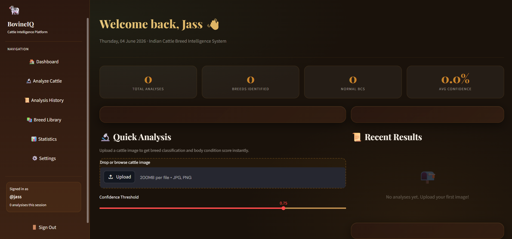
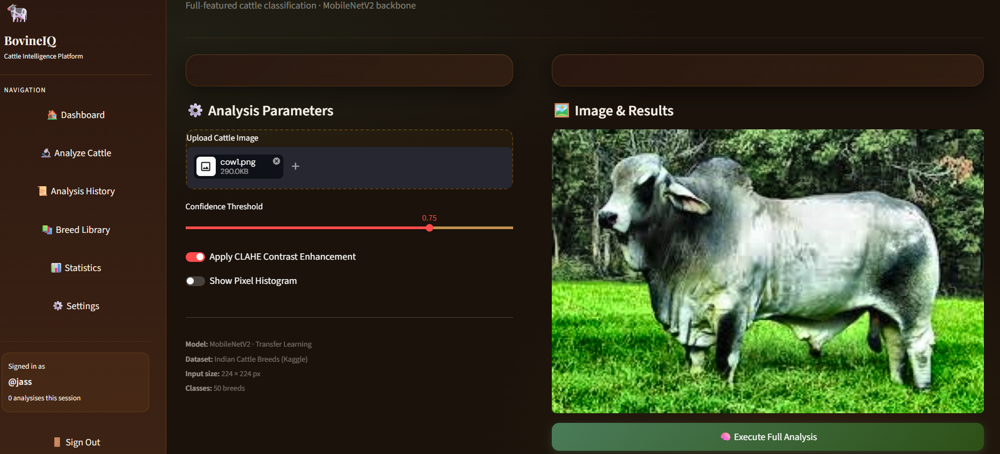
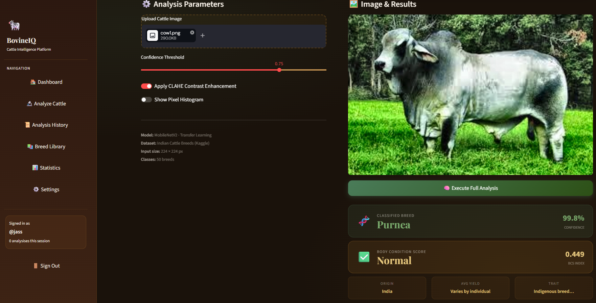
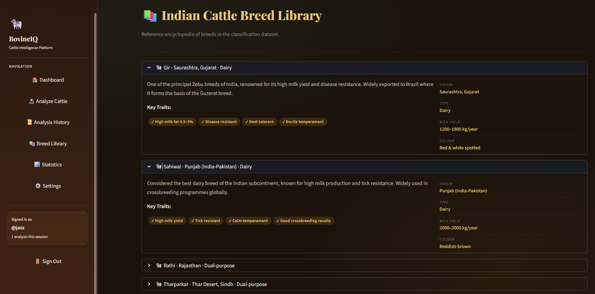
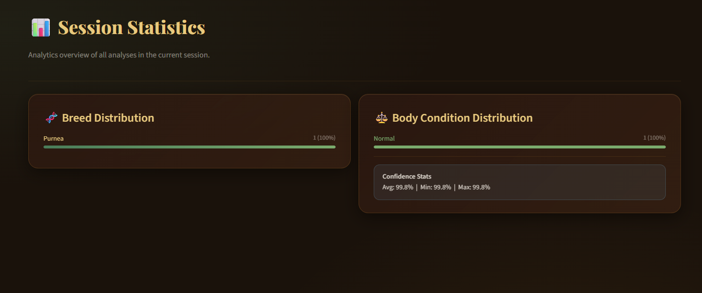
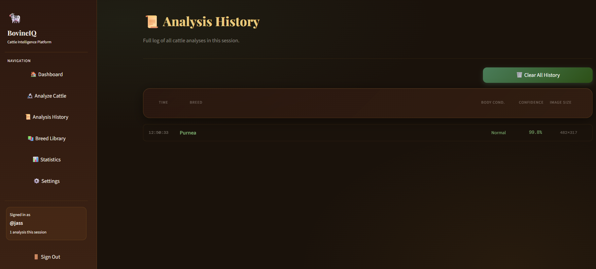

# 🐄 Cattle Breed Classification and Body Condition Scoring System

An AI-powered web application for automatic cattle breed classification and Body Condition Score (BCS) prediction using Deep Learning and Computer Vision.

---

## 📌 Project Overview

This system helps farmers, veterinarians, and livestock managers identify cattle breeds and evaluate body condition from images.

The application uses a trained MobileNetV2 deep learning model integrated with a Streamlit web application for real-time prediction.

---

## ✨ Features

- User Authentication System
- Cattle Breed Classification
- Body Condition Scoring (BCS)
- Breed Information Library
- Prediction History Tracking
- Statistical Analysis Dashboard
- Interactive Streamlit Interface

---

## 🛠 Technology Stack

### Frontend
- Streamlit

### Backend
- Python

### Deep Learning
- TensorFlow
- Keras
- MobileNetV2

### Data Processing
- NumPy
- PIL
- JSON

---

## 📂 Project Structure

```text
app.py                 Main Streamlit Application
breed_model.keras      Trained Deep Learning Model
labels.json            Breed Labels
users.json             User Database
requirements.txt       Project Dependencies
```

---

## 🚀 Installation

### Clone Repository

```bash
git clone YOUR_GITHUB_LINK
cd Cattle-Breed-Classification-and-BCS
```

### Install Dependencies

```bash
pip install -r requirements.txt
```

### Run Application

```bash
streamlit run app.py
```

---

## 📸 Application Screenshots

### Login Page


### Dashboard



### Upload Image



### Prediction Result



### Breed Library



### Statistics Dashboard



### Prediction History



---

## 🎯 Model Information

Model Architecture: MobileNetV2

Framework: TensorFlow / Keras

Input: Cattle Image

Output:
- Breed Classification
- Body Condition Score Prediction

---

## 📈 Future Enhancements

- Real-time Camera Detection
- Mobile Application Integration
- Cloud Deployment
- Multi-Animal Detection
- Advanced Health Analytics

---

## 👩‍💻 Author

Jaskirat Kour

Mini Project

Department of Computer Science & Engineering
